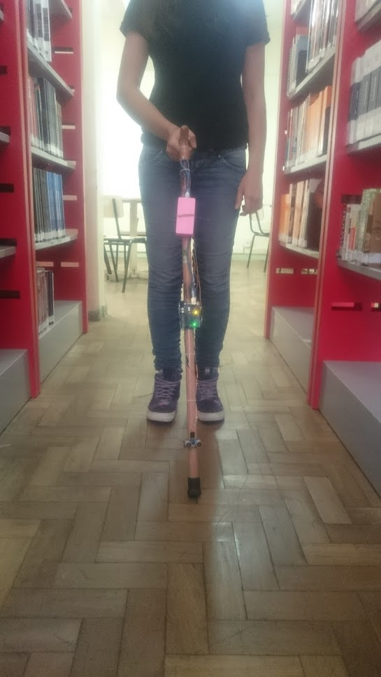

# BengalaEletronica

Projeto desenvolvido em 2016, campeão do primeiro lugar geral na 26a Mostra Específica de Trabalhos e
Aplicações – META do CEFET-MG. O protótipo consiste em uma bengala eletrônica que através de um sensor ultrassônico identifica obstáculos no percurso e os envia ao arduino,
que por sua vez interpreta esses dados e de acordo com a distância do obstáculo envia ou não sinais para os motores, fazendo com que a bengala vibre e o deficiente visual
consiga identificar obstáculos no percurso com antecedência sem a necessidade de encostar no mesmo. Posteriormente foi desenvolvido um aplicativo que consegue se conectar com a 
bengala via WI-fi, atráves do ESP8266, e enviar sinais que o arduino e intrepreta e pode ou não ligar um Buzzer, que emite um sinal sonoro para que o deficiente visual consiga encontra a bengala em sua casa, ou em outro ambiente, em que ele deixou de usa-lá.

O protótipo foi desenvolvido com tecnologias do Arduino®, que é
uma plataforma de desenvolvimento de hardware simples e livre,. A placa usada é
equipada com microcontrolador Atmel® e foi programada usando C++.

O trabalho prático foi desenvolvido nas seguintes etapas: 

1ª - Análise
dos recursos disponíveis no microcontrolador utilizado, bem como
das ferramentas de desenvolvimento de projeto; 

2ª - Estudo sobre
dificuldades encontradas por deficientes visuais com o objetivo de
identificar e definir o recurso tecnológico que traria maior ganho
para a qualidade de vida dessas pessoas;

3ª - Desenvolvimento dos
recursos e tecnologias assistivas para a bengala eletrônica, considerando definição e aquisição de material, programação e testes do
sistema; 

4ª - Testes e análise da eficiência no uso do equipamento,
simulando situações vivenciadas por deficientes visuais no dia-a-
-dia; 

5ª - Divulgação dos resultados à comunidade acadêmica, através de apresentações orais e participações em eventos.

Maior descrição do projeto, [📄](./Relatório.pdf "Relatorio") e no https://seer.dppg.cefetmg.br/index.php/revistadameta/article/viewFile/913/780 
